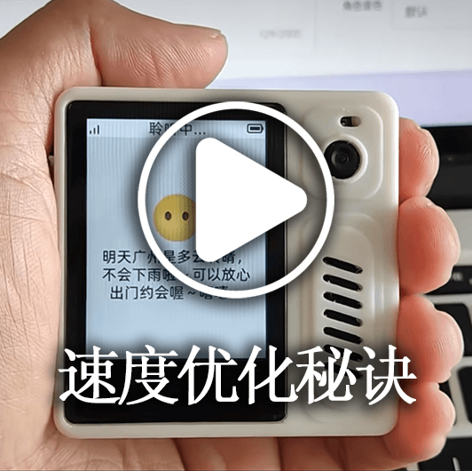
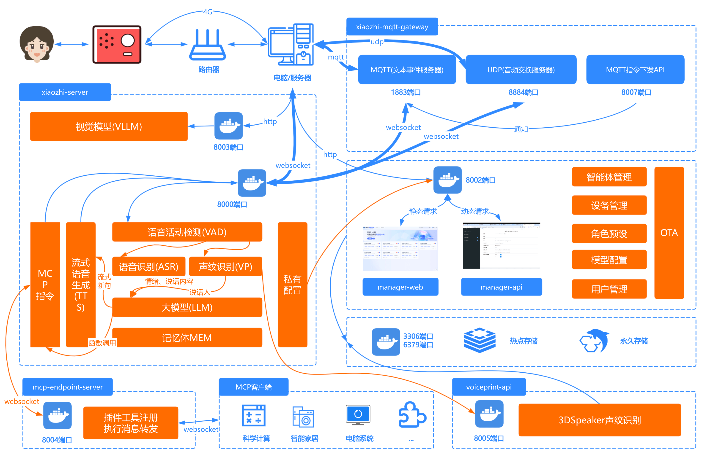

[](https://github.com/xinnan-tech/xiaozhi-esp32-server)

<h1 align="center">Serviço Backend Xiaozhi xiaozhi-esp32-server</h1>

<p align="center">
Este projeto é baseado na teoria e tecnologia de inteligência simbiótica humano-máquina para desenvolver sistemas inteligentes de hardware e software para terminais<br/>fornecendo serviços de backend para o projeto de hardware inteligente de código aberto
<a href="https://github.com/78/xiaozhi-esp32">xiaozhi-esp32</a><br/>
Implementado usando Python, Java e Vue de acordo com o <a href="https://ccnphfhqs21z.feishu.cn/wiki/M0XiwldO9iJwHikpXD5cEx71nKh">Protocolo de Comunicação Xiaozhi</a><br/>
Suporte ao protocolo MQTT+UDP, protocolo WebSocket, ponto de acesso MCP, reconhecimento de impressão vocal e base de conhecimento
</p>

<p align="center">
<a href="./docs/FAQ.md">Perguntas Frequentes</a>
· <a href="https://github.com/xinnan-tech/xiaozhi-esp32-server/issues">Reportar Problemas</a>
· <a href="./README.md#%E9%83%A8%E7%BD%B2%E6%96%87%E6%A1%A3">Documentação de Implantação</a>
· <a href="https://github.com/xinnan-tech/xiaozhi-esp32-server/releases">Notas de Lançamento</a>
</p>

<p align="center">
  <a href="./README.md"></a>
  <a href="./README_en.md"></a>
  <a href="./README_vi.md"></a>
  <a href="./README_de.md"></a>
  <a href="./README_pt_BR.md"></a>
  <a href="https://github.com/xinnan-tech/xiaozhi-esp32-server/releases">
    
  </a>
  <a href="https://github.com/xinnan-tech/xiaozhi-esp32-server/blob/main/LICENSE">
    
  </a>
  <a href="https://github.com/xinnan-tech/xiaozhi-esp32-server">
    
  </a>
</p>

<p align="center">
Liderado pela Equipe do Professor Siyuan Liu (Universidade de Tecnologia do Sul da China)
</br>
刘思源教授团队主导研发（华南理工大学）
</br>

</p>

---

## Público-Alvo 👥

Este projeto requer dispositivos de hardware ESP32 para funcionar. Se você adquiriu hardware relacionado ao ESP32, conectou-se com sucesso ao serviço backend implantado pelo Brother Xia e deseja construir seu próprio serviço backend `xiaozhi-esp32` de forma independente, então este projeto é perfeito para você.

Quer ver os efeitos de uso? Clique nos vídeos abaixo 🎥

<table>
  <tr>
    <td>
        <a href="https://www.bilibili.com/video/BV1FMFyejExX" target="_blank">
         <picture>
           
         </picture>
        </a>
    </td>
    <td>
        <a href="https://www.bilibili.com/video/BV1vchQzaEse" target="_blank">
         <picture>
           
         </picture>
        </a>
    </td>
    <td>
        <a href="https://www.bilibili.com/video/BV1C1tCzUEZh" target="_blank">
         <picture>
           
         </picture>
        </a>
    </td>
    <td>
        <a href="https://www.bilibili.com/video/BV1zUW5zJEkq" target="_blank">
         <picture>
           
         </picture>
        </a>
    </td>
    <td>
        <a href="https://www.bilibili.com/video/BV1Exu3zqEDe" target="_blank">
         <picture>
           
         </picture>
        </a>
    </td>
  </tr>
  <tr>
    <td>
        <a href="https://www.bilibili.com/video/BV1pNXWYGEx1" target="_blank">
         <picture>
           
         </picture>
        </a>
    </td>
    <td>
        <a href="https://www.bilibili.com/video/BV1ZQKUzYExM" target="_blank">
         <picture>
           
         </picture>
        </a>
    </td>
    <td>
      <a href="https://www.bilibili.com/video/BV1TJ7WzzEo6" target="_blank">
         <picture>
           
         </picture>
        </a>
    </td>
    <td>
        <a href="https://www.bilibili.com/video/BV1VC96Y5EMH" target="_blank">
         <picture>
           
         </picture>
        </a>
    </td>
    <td>
        <a href="https://www.bilibili.com/video/BV1Z8XuYZEAS" target="_blank">
         <picture>
           
         </picture>
        </a>
    </td>
  </tr>
  <tr>
    <td>
      <a href="https://www.bilibili.com/video/BV12J7WzBEaH" target="_blank">
         <picture>
           
         </picture>
        </a>
    </td>
    <td>
      <a href="https://www.bilibili.com/video/BV1Co76z7EvK" target="_blank">
         <picture>
           
         </picture>
        </a>
    </td>
    <td>
        <a href="https://www.bilibili.com/video/BV1CDKWemEU6" target="_blank">
         <picture>
           
         </picture>
        </a>
    </td>
    <td>
        <a href="https://www.bilibili.com/video/BV12yA2egEaC" target="_blank">
         <picture>
           
         </picture>
        </a>
    </td>
    <td>
        <a href="https://www.bilibili.com/video/BV17LXWYvENb" target="_blank">
         <picture>
           
         </picture>
        </a>
    </td>
  </tr>
</table>

---

## Avisos ⚠️

1. Este projeto é um software de código aberto. Este software não possui parceria comercial com nenhum provedor de serviços de API de terceiros (incluindo, mas não se limitando a reconhecimento de fala, modelos de linguagem, síntese de voz e outras plataformas) com os quais se conecta, e não fornece nenhuma forma de garantia quanto à qualidade de serviço ou segurança financeira desses provedores. Recomenda-se que os usuários priorizem provedores de serviço com licenças comerciais relevantes e leiam cuidadosamente seus termos de serviço e políticas de privacidade. Este software não armazena nenhuma chave de conta, não participa de fluxos de fundos e não assume o risco de perda de fundos recarregados.

2. A funcionalidade deste projeto não está completa e não passou por avaliação de segurança de rede. Por favor, não o utilize em ambientes de produção. Se você implantar este projeto para fins de aprendizado em um ambiente de rede pública, certifique-se de que as medidas de proteção necessárias estejam em vigor.

---

## Documentação de Implantação


Este projeto oferece dois métodos de implantação. Por favor, escolha de acordo com suas necessidades específicas:

#### 🚀 Seleção do Método de Implantação
| Método de Implantação | Funcionalidades | Cenários Aplicáveis | Documentação de Implantação | Requisitos de Configuração | Tutoriais em Vídeo |
|---------|------|---------|---------|---------|---------|
| **Instalação Simplificada** | Diálogo inteligente, gerenciamento de agente único | Ambientes de baixa configuração, dados armazenados em arquivos de configuração, sem necessidade de banco de dados | [①Versão Docker](./docs/Deployment.md#%E6%96%B9%E5%BC%8F%E4%B8%80docker%E5%8F%AA%E8%BF%90%E8%A1%8Cserver) / [②Implantação via Código-Fonte](./docs/Deployment.md#%E6%96%B9%E5%BC%8F%E4%BA%8C%E6%9C%AC%E5%9C%B0%E6%BA%90%E7%A0%81%E5%8F%AA%E8%BF%90%E8%A1%8Cserver)| 2 núcleos 4GB se usar `FunASR`, 2 núcleos 2GB se todas APIs | - |
| **Instalação de Módulo Completo** | Diálogo inteligente, gerenciamento multiusuário, gerenciamento de múltiplos agentes, operação de interface do console inteligente | Experiência com funcionalidade completa, dados armazenados em banco de dados |[①Versão Docker](./docs/Deployment_all.md#%E6%96%B9%E5%BC%8F%E4%B8%80docker%E8%BF%90%E8%A1%8C%E5%85%A8%E6%A8%A1%E5%9D%97) / [②Implantação via Código-Fonte](./docs/Deployment_all.md#%E6%96%B9%E5%BC%8F%E4%BA%8C%E6%9C%AC%E5%9C%B0%E6%BA%90%E7%A0%81%E8%BF%90%E8%A1%8C%E5%85%A8%E6%A8%A1%E5%9D%97) / [③Tutorial de Atualização Automática via Código-Fonte](./docs/dev-ops-integration.md) | 4 núcleos 8GB se usar `FunASR`, 2 núcleos 4GB se todas APIs| [Tutorial em Vídeo de Inicialização via Código-Fonte Local](https://www.bilibili.com/video/BV1wBJhz4Ewe) |

Perguntas frequentes e tutoriais relacionados podem ser consultados [neste link](./docs/FAQ.md)

> 💡 Nota: Abaixo está uma plataforma de teste implantada com o código mais recente. Você pode gravar e testar se necessário. Usuários simultâneos: 6, os dados serão limpos diariamente.

```
Endereço do Console de Controle Inteligente: https://2662r3426b.vicp.fun
Endereço do Console de Controle Inteligente (H5): https://2662r3426b.vicp.fun/h5/index.html

Ferramenta de Teste de Serviço: https://2662r3426b.vicp.fun/test/
Endereço da Interface OTA: https://2662r3426b.vicp.fun/xiaozhi/ota/
Endereço da Interface WebSocket: wss://2662r3426b.vicp.fun/xiaozhi/v1/
```

#### 🚩 Descrição e Recomendações de Configuração
> [!Note]
> Este projeto oferece dois esquemas de configuração:
>
> 1. `Configurações Gratuitas Nível Básico`: Adequado para uso pessoal e doméstico, todos os componentes utilizam soluções gratuitas, sem necessidade de pagamento adicional.
>
> 2. `Configuração de Streaming`: Adequado para demonstrações, treinamentos, cenários com mais de 2 usuários simultâneos, etc. Utiliza tecnologia de processamento em streaming para velocidade de resposta mais rápida e melhor experiência.
>
> A partir da versão `0.5.2`, o projeto suporta configuração de streaming. Em comparação com versões anteriores, a velocidade de resposta é melhorada em aproximadamente `2,5 segundos`, melhorando significativamente a experiência do usuário.

| Nome do Módulo | Configurações Gratuitas Nível Básico | Configuração de Streaming |
|:---:|:---:|:---:|
| ASR(Reconhecimento de Fala) | FunASR(Local) | 👍XunfeiStreamASR(Xunfei Streaming) |
| LLM(Modelo de Linguagem) | glm-4-flash(Zhipu) | 👍qwen-flash(Alibaba Bailian) |
| VLLM(Modelo de Visão) | glm-4v-flash(Zhipu) | 👍qwen3.5-flash(Alibaba Bailian) |
| TTS(Síntese de Voz) | EdgeTTS(Microsoft) | 👍HuoshanDoubleStreamTTS(Volcano Streaming) |
| Intent(Reconhecimento de Intenção) | function_call(Chamada de função) | function_call(Chamada de função) |
| Memory(Função de Memória) | mem_local_short(Memória local de curto prazo) | mem_local_short(Memória local de curto prazo) |

Se você está preocupado com o tempo de resposta de cada componente, consulte o [Relatório de Teste de Desempenho dos Componentes Xiaozhi](https://github.com/xinnan-tech/xiaozhi-performance-research), e teste em seu próprio ambiente seguindo os métodos de teste do relatório.

#### 🔧 Ferramentas de Teste
Este projeto fornece as seguintes ferramentas de teste para ajudá-lo a verificar o sistema e escolher modelos adequados:

| Nome da Ferramenta | Localização | Método de Uso | Descrição da Função |
|:---:|:---|:---:|:---:|
| Ferramenta de Teste de Interação por Áudio | main》xiaozhi-server》test》test_page.html | Abrir diretamente com Google Chrome | Testa as funções de reprodução e recepção de áudio, verifica se o processamento de áudio no lado Python está normal |
| Ferramenta de Teste de Resposta de Modelo | main》xiaozhi-server》performance_tester.py | Execute `python performance_tester.py` | Testa a velocidade de resposta dos três módulos principais: ASR(reconhecimento de fala), LLM(modelo de linguagem), VLLM(modelo de visão), TTS(síntese de voz) |

> 💡 Nota: Ao testar a velocidade dos modelos, apenas os modelos com chaves configuradas serão testados.

---
## Lista de Funcionalidades ✨
### Implementado ✅

| Módulo de Funcionalidade | Descrição |
|:---:|:---|
| Arquitetura Principal | Baseado em [gateway MQTT+UDP](https://github.com/xinnan-tech/xiaozhi-esp32-server/blob/main/docs/mqtt-gateway-integration.md), servidores WebSocket e HTTP, fornece sistema completo de gerenciamento de console e autenticação |
| Interação por Voz | Suporta ASR em streaming (reconhecimento de fala), TTS em streaming (síntese de voz), VAD (detecção de atividade vocal), suporta reconhecimento multilíngue e processamento de voz |
| Reconhecimento de Impressão Vocal | Suporta registro, gerenciamento e reconhecimento de impressão vocal de múltiplos usuários, processa em paralelo com o ASR, reconhecimento de identidade do falante em tempo real e repassa ao LLM para respostas personalizadas |
| Diálogo Inteligente | Suporta múltiplos LLM (modelos de linguagem de grande porte), implementa diálogo inteligente |
| Percepção Visual | Suporta múltiplos VLLM (modelos de visão de grande porte), implementa interação multimodal |
| Reconhecimento de Intenção | Suporta reconhecimento de intenção por LLM, Function Call (chamada de função), fornece mecanismo de processamento de intenção baseado em plugins |
| Sistema de Memória | Suporta memória local de curto prazo, memória via interface mem0ai, memória inteligente PowerMem, com funcionalidade de resumo de memória |
| Base de Conhecimento | Suporta base de conhecimento RAGFlow, permitindo que o LLM julgue se deve acionar a base de conhecimento após receber a pergunta do usuário, e então responda à pergunta |
| Chamada de Ferramentas | Suporta protocolo IOT do cliente, protocolo MCP do cliente, protocolo MCP do servidor, protocolo de endpoint MCP, funções de ferramentas personalizadas |
| Envio de Comandos | Suporta envio de comandos MCP para dispositivos ESP32 via protocolo MQTT a partir do Console Inteligente |
| Backend de Gerenciamento | Fornece interface de gerenciamento Web, suporta gerenciamento de usuários, configuração do sistema e gerenciamento de dispositivos; Suporta exibição em Chinês Simplificado, Chinês Tradicional e Inglês |
| Ferramentas de Teste | Fornece ferramentas de teste de desempenho, ferramentas de teste de modelo de visão e ferramentas de teste de interação por áudio |
| Suporte à Implantação | Suporta implantação via Docker e implantação local, fornece gerenciamento completo de arquivos de configuração |
| Sistema de Plugins | Suporta extensões de plugins funcionais, desenvolvimento de plugins personalizados e carregamento dinâmico de plugins |

### Em Desenvolvimento 🚧

Para conhecer o progresso específico do plano de desenvolvimento, [clique aqui](https://github.com/users/xinnan-tech/projects/3). Perguntas frequentes e tutoriais relacionados podem ser consultados [neste link](./docs/FAQ.md)

Se você é um desenvolvedor de software, aqui está uma [Carta Aberta aos Desenvolvedores](docs/contributor_open_letter.md). Seja bem-vindo a participar!

---

## Ecossistema do Produto 👬
Xiaozhi é um ecossistema. Ao utilizar este produto, você também pode conferir outros [projetos excelentes](https://github.com/78/xiaozhi-esp32/blob/main/README_zh.md#%E7%9B%B8%E5%85%B3%E5%BC%80%E6%BA%90%E9%A1%B9%E7%9B%AE) neste ecossistema

---

## Lista de Plataformas/Componentes Suportados 📋
### LLM Modelos de Linguagem

| Método de Uso | Plataformas Suportadas | Plataformas Gratuitas |
|:---:|:---:|:---:|
| Chamadas via interface OpenAI | Alibaba Bailian, Volcano Engine, DeepSeek, Zhipu, Gemini, iFLYTEK | Zhipu, Gemini |
| Chamadas via interface Ollama | Ollama | - |
| Chamadas via interface Dify | Dify | - |
| Chamadas via interface FastGPT | FastGPT | - |
| Chamadas via interface Coze | Coze | - |
| Chamadas via interface Xinference | Xinference | - |
| Chamadas via interface HomeAssistant | HomeAssistant | - |

Na verdade, qualquer LLM que suporte chamadas via interface openai pode ser integrado e utilizado.

---

### VLLM Modelos de Visão

| Método de Uso | Plataformas Suportadas | Plataformas Gratuitas |
|:---:|:---:|:---:|
| Chamadas via interface OpenAI | Alibaba Bailian, Zhipu ChatGLMVLLM | Zhipu ChatGLMVLLM |

Na verdade, qualquer VLLM que suporte chamadas via interface OpenAI pode ser integrado e utilizado.

---

### TTS Síntese de Voz

| Método de Uso | Plataformas Suportadas | Plataformas Gratuitas |
|:---:|:---:|:---:|
| Chamadas via interface | EdgeTTS, iFLYTEK, Volcano Engine, Tencent Cloud, Alibaba Cloud e Bailian, CosyVoiceSiliconflow, TTS302AI, CozeCnTTS, GizwitsTTS, ACGNTTS, OpenAITTS, Lingxi Streaming TTS, MinimaxTTS | Lingxi Streaming TTS, EdgeTTS, CosyVoiceSiliconflow(parcial) |
| Serviços locais | FishSpeech, GPT_SOVITS_V2, GPT_SOVITS_V3, Index-TTS, PaddleSpeech | Index-TTS, PaddleSpeech, FishSpeech, GPT_SOVITS_V2, GPT_SOVITS_V3 |

---

### VAD Detecção de Atividade Vocal

| Tipo | Nome da Plataforma | Método de Uso | Modelo de Preço | Observações |
|:---:|:---------:|:----:|:----:|:--:|
| VAD | SileroVAD | Uso local | Gratuito | |

---

### ASR Reconhecimento de Fala

| Método de Uso | Plataformas Suportadas | Plataformas Gratuitas |
|:---:|:---:|:---:|
| Uso local | FunASR, SherpaASR | FunASR, SherpaASR |
| Chamadas via interface | FunASRServer, Volcano Engine, iFLYTEK, Tencent Cloud, Alibaba Cloud, Baidu Cloud, OpenAI ASR | FunASRServer |

---

### Reconhecimento de Impressão Vocal

| Método de Uso | Plataformas Suportadas | Plataformas Gratuitas |
|:---:|:---:|:---:|
| Uso local | 3D-Speaker | 3D-Speaker |

---

### Armazenamento de Memória

| Tipo | Nome da Plataforma | Método de Uso | Modelo de Preço | Observações |
|:------:|:---------------:|:----:|:---------:|:--:|
| Memória | mem0ai | Chamadas via interface | Cota de 1000 vezes/mês | |
| Memória | [powermem](./docs/powermem-integration.md) | Resumo local | Depende do LLM e BD | OceanBase de código aberto, suporta busca inteligente |
| Memória | mem_local_short | Resumo local | Gratuito | |
| Memória | nomem | Modo sem memória | Gratuito | |

---

### Reconhecimento de Intenção

| Tipo | Nome da Plataforma | Método de Uso | Modelo de Preço | Observações |
|:------:|:-------------:|:----:|:-------:|:---------------------:|
| Intenção | intent_llm | Chamadas via interface | Baseado no preço do LLM | Reconhece intenção através de modelos de linguagem, forte generalização |
| Intenção | function_call | Chamadas via interface | Baseado no preço do LLM | Completa a intenção através de chamada de função do modelo de linguagem, velocidade rápida, bom resultado |
| Intenção | nointent | Modo sem intenção | Gratuito | Não realiza reconhecimento de intenção, retorna diretamente o resultado do diálogo |

---

### RAG Geração Aumentada por Recuperação

| Tipo | Nome da Plataforma | Método de Uso | Modelo de Preço | Observações |
|:------:|:-------------:|:----:|:-------:|:---------------------:|
| RAG | ragflow | Chamadas via interface | Cobrado com base nos tokens consumidos para fatiamento e segmentação de palavras | Utiliza o recurso de geração aumentada por recuperação do RagFlow para fornecer respostas de diálogo mais precisas |

---

## Agradecimentos 🙏

| Logo | Projeto/Empresa | Descrição |
|:---:|:---:|:---|
|  | [Robô de Diálogo por Voz Bailing](https://github.com/wwbin2017/bailing) | Este projeto foi inspirado pelo [Robô de Diálogo por Voz Bailing](https://github.com/wwbin2017/bailing) e implementado com base nele |
|  | [Tenclass](https://www.tenclass.com/) | Agradecimentos à [Tenclass](https://www.tenclass.com/) por formular protocolos de comunicação padrão, soluções de compatibilidade multidispositivo e demonstrações práticas de cenários de alta concorrência para o ecossistema Xiaozhi; fornecendo suporte completo de documentação técnica para este projeto |
|  | [Xuanfeng Technology (玄凤科技)](https://github.com/Eric0308) | Agradecimentos à [Xuanfeng Technology](https://github.com/Eric0308) por contribuir com o framework de chamada de função, protocolo de comunicação MCP e implementação do mecanismo de chamada baseado em plugins. Através de um sistema padronizado de agendamento de instruções e capacidades de expansão dinâmica, melhora significativamente a eficiência de interação e extensibilidade funcional dos dispositivos de frontend (IoT) |
|  | [huangjunsen](https://github.com/huangjunsen0406) | Agradecimentos a [huangjunsen](https://github.com/huangjunsen0406) por contribuir com o módulo `Console de Controle Inteligente Mobile`, que permite controle eficiente e interação em tempo real em dispositivos móveis, melhorando significativamente a conveniência operacional e a eficiência de gerenciamento do sistema em cenários móveis. |
|  | [Huiyuan Design (汇远设计)](http://ui.kwd988.net/) | Agradecimentos à [Huiyuan Design](http://ui.kwd988.net/) por fornecer soluções visuais profissionais para este projeto, utilizando sua experiência prática de design atendendo mais de mil empresas para potencializar a experiência do usuário deste produto |
|  | [Xi'an Qinren Information Technology (西安勤人信息科技)](https://www.029app.com/) | Agradecimentos à [Xi'an Qinren Information Technology](https://www.029app.com/) por aprofundar o sistema visual deste projeto, garantindo consistência e extensibilidade do estilo de design geral em aplicações de múltiplos cenários |
|  | [Contribuidores de Código](https://github.com/xinnan-tech/xiaozhi-esp32-server/graphs/contributors) | Agradecimentos a [todos os contribuidores de código](https://github.com/xinnan-tech/xiaozhi-esp32-server/graphs/contributors), seus esforços tornaram o projeto mais robusto e poderoso. |


<a href="https://star-history.com/#xinnan-tech/xiaozhi-esp32-server&Date">

 <picture>
   <source media="(prefers-color-scheme: dark)" srcset="https://api.star-history.com/svg?repos=xinnan-tech/xiaozhi-esp32-server&type=Date&theme=dark" />
   <source media="(prefers-color-scheme: light)" srcset="https://api.star-history.com/svg?repos=xinnan-tech/xiaozhi-esp32-server&type=Date" />
   
 </picture>
</a>
